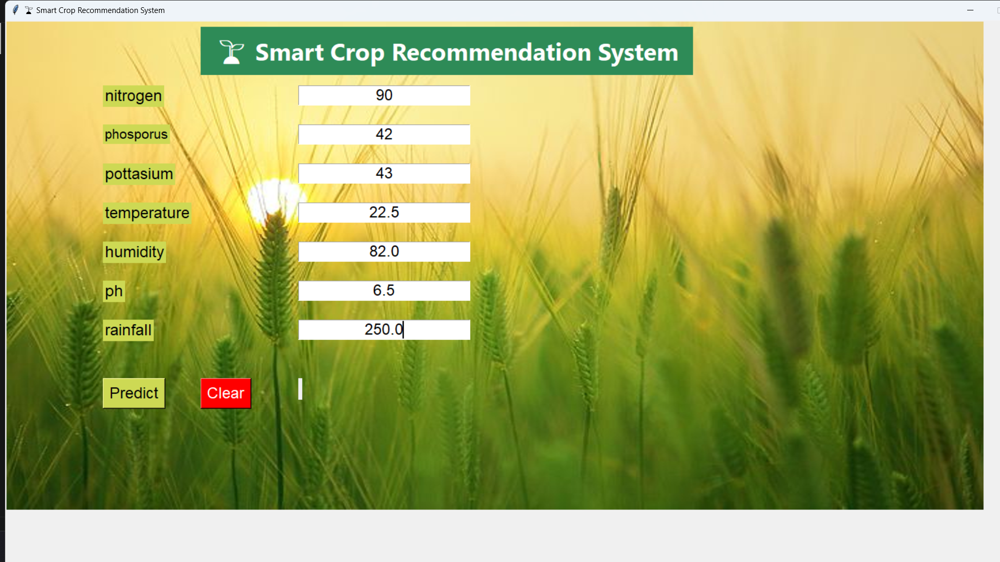
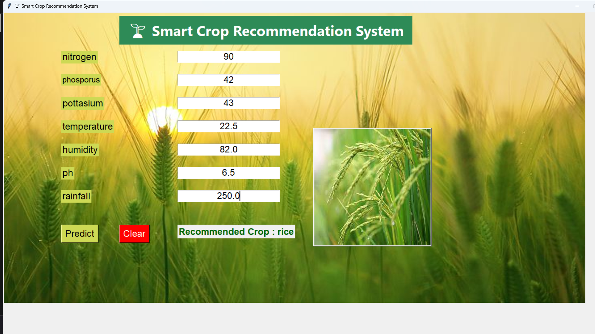

# 🌱 Smart Crop Recommendation System using Machine Learning

<div align="center">

### An Intelligent Machine Learning-Based Decision Support System for Smart Agriculture

**Python • Machine Learning • Random Forest • Tkinter • Scikit-learn • Pandas**

</div>

---

## 📌 Overview

The **Smart Crop Recommendation System** is a Machine Learning application developed to assist farmers and agricultural professionals in selecting the most suitable crop based on soil nutrients and environmental conditions.

The system utilizes a **Random Forest Classifier** trained on agricultural data to analyze essential soil and climate parameters and recommend the optimal crop. The application features an interactive desktop interface built using **Tkinter**, making it easy for users to enter values and receive instant recommendations.

This project demonstrates the practical application of Machine Learning in precision agriculture and sustainable farming.

---

## 🎯 Problem Statement

Selecting the right crop is one of the most important decisions in agriculture. Traditional crop selection often depends on experience rather than scientific analysis, which can result in:

* Reduced crop yield
* Improper soil utilization
* Increased production costs
* Lower profitability

This project addresses these challenges by providing an intelligent crop recommendation system based on data-driven decision making.

---

## ✨ Key Features

* Machine Learning-based crop recommendation
* Interactive desktop application using Tkinter
* Prediction using Random Forest Classifier
* Crop image display after prediction
* Input validation for user-friendly operation
* High prediction accuracy
* Lightweight and easy-to-use interface
* Fast prediction with pre-trained model
* Clean and modular Python implementation

---

## 🛠️ Technology Stack

| Category             | Technologies       |
| -------------------- | ------------------ |
| Programming Language | Python             |
| Machine Learning     | Scikit-learn       |
| Data Processing      | Pandas, NumPy      |
| GUI Development      | Tkinter            |
| Image Processing     | Pillow             |
| Model Storage        | Pickle             |
| IDE                  | Visual Studio Code |

---

## 📊 Machine Learning Model

**Algorithm Used**

* Random Forest Classifier

### Input Parameters

The prediction model uses the following agricultural parameters:

* Nitrogen (N)
* Phosphorus (P)
* Potassium (K)
* Temperature
* Humidity
* Soil pH
* Rainfall

### Output

* Recommended Crop
* Crop Image

---

## 📁 Project Structure

```text
Crop-Recommendation-System/
│
├── crop.py
├── crop_recommendation.csv
├── RandomForest.pkl
├── requirements.txt
├── README.md
├── .gitignore
│
├── result/
│   ├── apple.jpg
│   ├── banana.jpg
│   ├── mango.jpg
│   ├── rice.jpg
│   └── ...
│
└── screenshots/
```

---

## ⚙️ Installation

### Clone the Repository

```bash
git clone https://github.com/your-username/Crop-Recommendation-System.git
```

### Navigate to the Project

```bash
cd Crop-Recommendation-System
```

### Create Virtual Environment

**Windows**

```bash
python -m venv venv
```

Activate the environment:

```bash
venv\Scripts\activate
```

### Install Required Packages

```bash
pip install -r requirements.txt
```

### Run the Application

```bash
python crop.py
```

---

## 🖥️ Application Workflow

1. Launch the application.
2. Enter soil nutrient values.
3. Provide environmental parameters.
4. Click the **Predict** button.
5. View the recommended crop.
6. Display the corresponding crop image.

---

## 📸 Screenshots

### Home Screen


---

### Crop Recommendation



---

### Prediction Result



---

## 📈 Project Highlights

* Desktop-based Machine Learning application
* Real-world agricultural use case
* User-friendly graphical interface
* High model accuracy
* Data-driven crop recommendation
* Image-based prediction output
* Modular and maintainable Python code

---

## 🔮 Future Enhancements

* Weather API Integration
* Fertilizer Recommendation System
* Soil Health Analysis
* Disease Detection using Deep Learning
* Profit Prediction
* Market Price Analysis
* GPS-based Location Detection
* Multi-language Support
* Web Application using Flask
* Mobile Application Development

---

## 🎓 Learning Outcomes

This project strengthened practical knowledge in:

* Machine Learning
* Data Preprocessing
* Feature Engineering
* Random Forest Classification
* Desktop Application Development
* Image Handling in Python
* Software Development Best Practices
* Version Control using Git and GitHub

---

## 💼 Skills Demonstrated

* Python Programming
* Machine Learning
* Data Analysis
* GUI Development
* Problem Solving
* Software Design
* Git & GitHub
* Model Deployment
* Agricultural Technology

---

## 👨‍💻 Author

**Sathvik B S**

Master of Computer Applications (MCA)

Presidency University, Bengaluru

GitHub: https://github.com/your-username

LinkedIn: https://linkedin.com/in/your-profile

---

## 📄 License

This project is licensed under the **MIT License**.

---

## ⭐ Support

If you found this project useful, please consider giving it a **Star ⭐** on GitHub.

Your support is greatly appreciated.
